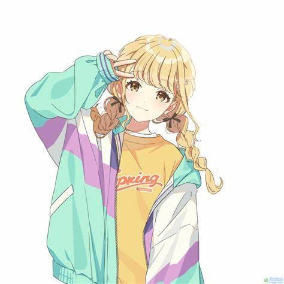

# NailongIdentification
A simple model for Identification of nailong based on deep learning  
Model reaches the accuracy of over 97%, and it can accurately tell Nailong from Konote Fujita！  
<table>
  <tr>
    <td></td>
    <td></td>
  </tr>
</table>

### Just For Fun!!!  
#### Trained by network VGG11   
Process are visualized as figure including loss and accuracy  
## Dataset  
Dataset are download from https://huggingface.co/datasets/XiC1/nailong-dataset  
## Music  
Music and inspiration come from https://www.douyin.com/video/7433341884916862260
## Environment  
You need Python3.x, os, torch, torchvision, PIL, matplotlib, tkinter, pygame  
## How to use  
Download the whole project, make sure your environment is useful. Run api.py.  
